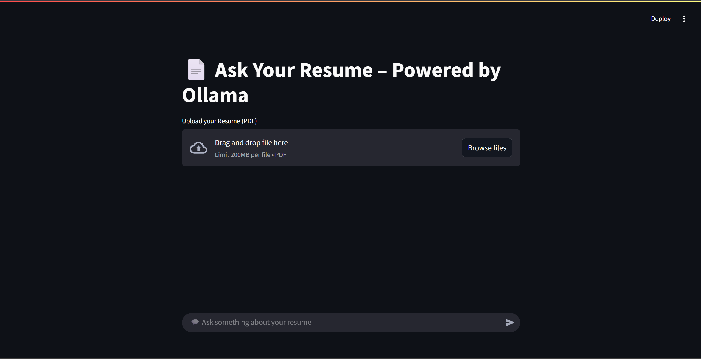
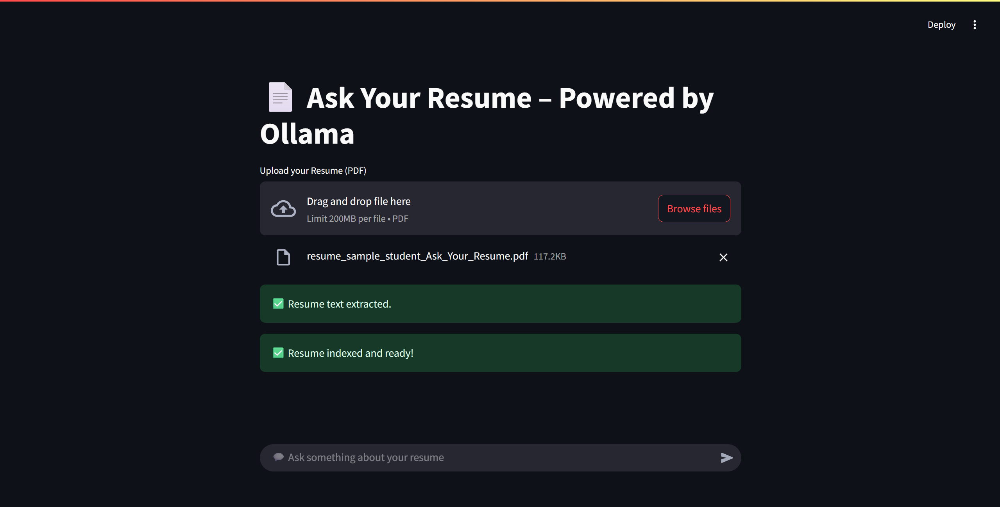
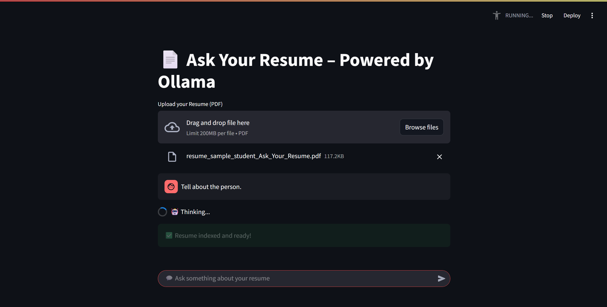
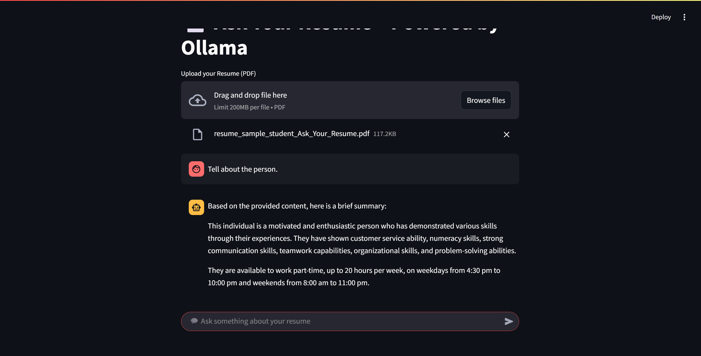
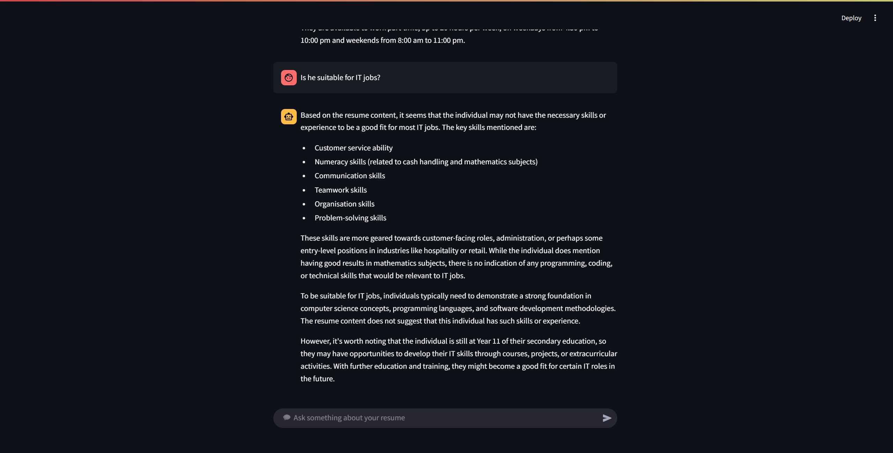

# Ask-Your-Resume
**Ask Your Resume** is an AI-powered web app that allows you to interact with your resume using natural language queries. Built with Streamlit, FAISS, and Ollama, it transforms your static resume into an intelligent, searchable chatbot powered by local LLMs.
---
## ✨ Features
- Upload your resume in `.pdf` format.
  

    
  

- Extracts and chunks resume text for better searchability.
  

    
  

- Uses FAISS for semantic similarity search.
- Local language generation with **LLaMA 3 via Ollama**.
- Ask questions like:
  - "What are my technical skills?"
  - "Where did I intern?"
  - "List my certifications."
- 🔁 Maintains chat session state (ask follow-ups).

  ---
## 🧠 How It Works

1. **Upload Resume**: Choose your `.pdf` resume file.
2. **Text Extraction**: Extracts readable text using `pdfplumber` or `PyMuPDF`.
3. **Chunking & Embedding**: Splits content into smaller parts and embeds with sentence transformers.
4. **Vector Indexing**: Uses FAISS to store and search vectorized resume chunks.
5. **Natural Language Query**: Your question + context → LLaMA 3 via `ollama`.
6. **Response Generation**: Returns a context-aware answer.
   

    
  

     
     
  

    
  

 
 

    
  
  

## 📦 Tech Stack

1. Frontend: Streamlit
2. Backend     : Python, Ollama (LLaMA3)
3. NLP Engine  : Retrieval-Augmented Generation (RAG)
4. Embeddings  : Sentence Transformers or Gemini-compatible
5. Search Index: FAISS
6.   PDF Parsing:pdfplumber

## 📁 Project Structure
Ask your Resume
- app.py
- utils.py
- requirements.txt
- README.md
- resumes
    - sample resumes

## 🛠 Installation & Setup
Step 1: Clone the repo (run in terminal)
 
 
git clone  https://github.com/DIVYANSH-TEJA-09/Ask-Your-Resume  
cd ask-your-resume
 
 
Step 2: Create a virtual environment
 
 
python -m venv .venv  
source .venv/bin/activate    # macOS/Linux  
.venv\Scripts\activate       # Windows  
 
   
Step 3: Install Python dependencies  
 
 
pip install -r requirements.txt
 
 
## 🦙 How to Install Ollama & LLaMA 3
Step 4: Install Ollama
- Visit https://ollama.com and download the app for your OS:

- macOS: brew install ollama

- Windows: Download the installer from the website

- Linux:(run)
   
   
  curl -fsSL https://ollama.com/install.sh | sh
   
   
  - Then run the Ollama server:
   
   
  ollama serve
 
 
Step 5: Download and Run LLaMA 3
To download and run the LLaMA 3 model:
 
 
ollama run llama3
 
 
Wait for it to pull the model (~4–8GB depending on the version). Once downloaded, Ollama will keep the model ready for all future use.
## Sample Questions to Ask
- What tools do I know?

- Where did I intern?

- List my certifications.

- What's my academic background?

- Generate a LinkedIn-style summary.

- Compare with a reference resume.

